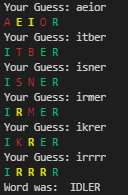

# Guess the word Game

This game is a simple guessing game where you have to guess a 5 letter word.

We have 12478 different words for you to play this game with!

Keep trying your luck as you have 5 chances to find the correct one.

## Rules of the game
---

1. You get 5 tries for correctly guessing the word
2. Each guess comes back with a feedback:
   * If a character is highlighted with green means it is correct
   * If a character is highlighted with red means it is incorrect
   * If a character is highlighted with yellow means it is present in the word but at a different location.
3. Based on the above rules, if you are able to guess the word, KUDOS!

## Environment Setup
---

You will require python3.6.9 or above and the dependencies in requirements.txt to run the game.

To install dependencies:

    pip install -r requirements.txt

Then to run the game:

    python game.py

or:

    python3 game.py

